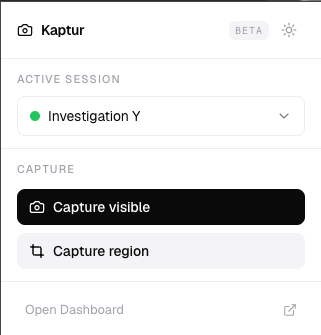
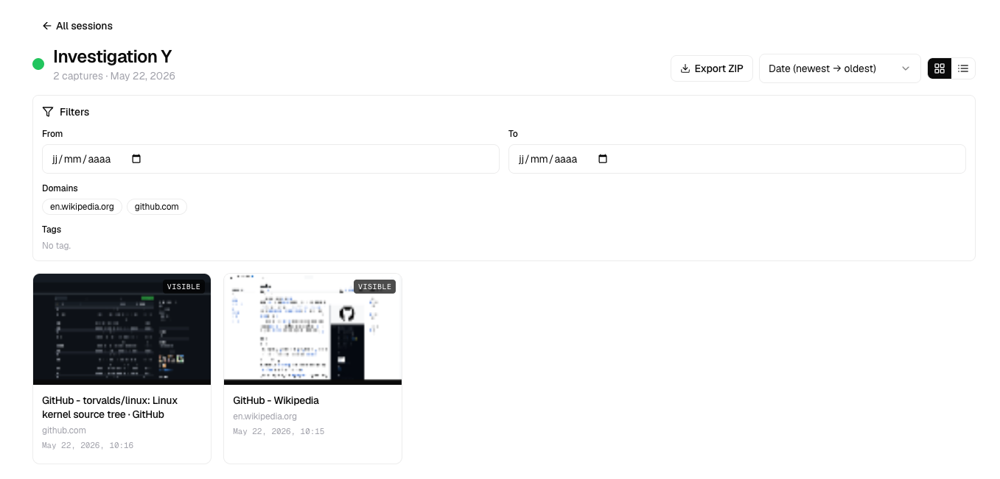
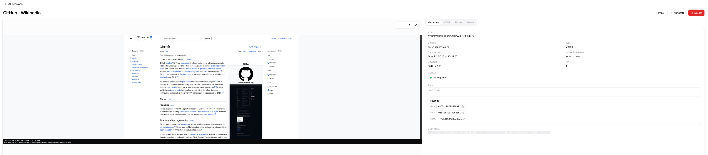

# Kaptur

> OSINT cross-browser screenshot, annotation and investigation tool. 100% local, zero telemetry.

Kaptur is a Chrome / Edge / Firefox extension that helps OSINT investigators
capture, annotate and organize screenshots, HTML and network traffic of any
web page. Everything lives in your browser's IndexedDB — no backend, no
analytics, no remote calls.

---

<p align="center">
  
</p>

<p align="center">
  
</p>

<p align="center">
  
</p>

---

## Features

- **Captures** : visible-tab screenshot, region selection with the mouse
- **Annotation editor** (Konva) : rectangle, arrow, text, highlight, blur,
  numbering — undo/redo, keyboard shortcuts (V, R, A, T, H, B, N)
- **Forensic banner** burned into every image : ISO 8601 timestamp + full
  SHA-256 hash on a clean strip appended below the screenshot
- **HTML DOM** of every captured page is saved alongside the image
- **Sessions** to group captures by investigation, with tags, notes,
  domain/date filters
- **Full-text search** (MiniSearch) on names, URLs, page titles, domains,
  notes and tags — `Cmd/Ctrl + K` to open
- **Customizable filename convention** for ZIP exports (tokens : `{index}`,
  `{timestamp}`, `{date}`, `{name}`, `{domain}`, `{session}`, `{type}`,
  `{hash}`)
- **Exports** :
  - Single capture as PNG (uses your naming convention)
  - Whole session as a ZIP of PNGs
  - Full database as a single `.kaptur` JSON backup file (images embedded as
    data URLs)
- **Import** a `.kaptur` file to restore a previous state

## Install

> Beta — store listings pending review.

| Browser | Status                           |
| ------- | -------------------------------- |
| Chrome  | Pending Chrome Web Store review  |
| Edge    | Pending Microsoft Add-ons review |
| Firefox | Pending AMO review               |

### Manual install (developer mode)

1. Download the latest release ZIP from [Releases](https://github.com/1d3fix/kaptur/releases)
2. **Chrome / Edge** : `chrome://extensions` → enable Developer mode → drag
   and drop `kaptur-1.0.0-chrome.zip` (or use "Load unpacked" after unzipping)
3. **Firefox** : `about:debugging` → This Firefox → Load Temporary Add-on →
   pick `manifest.json` from the unzipped folder

## Build from source

Requires Node 20.19+ and npm.

```bash
git clone https://github.com/1d3fix/kaptur.git
cd kaptur
npm install
npm run dev          # Chrome HMR
npm run dev:firefox  # Firefox HMR
npm run build        # production Chrome
npm run zip          # bundle into .output/*.zip
```

## Permissions justified

| Permission          | Why                                                                     |
| ------------------- | ----------------------------------------------------------------------- |
| `<all_urls>`        | Capture screenshots and HTML of any page the user explicitly captures   |
| `tabs`, `activeTab` | Read the active tab URL, title and viewport metadata                    |
| `scripting`         | Inject the region-selection overlay and grab `document.documentElement` |
| `storage`           | Remember the active session across browser restarts                     |

## Privacy

See [PRIVACY.md](./PRIVACY.md).

- **No data collection.** No analytics, no telemetry, no remote endpoint.
- **No outbound network request** is ever made by Kaptur, ever.
- **All data stays in your browser's IndexedDB** under the extension's
  isolated origin.
- The `<all_urls>` host permission is only ever exercised when **you**
  explicitly trigger a capture.

## Contributing

Issues and pull requests welcome at <https://github.com/1d3fix/kaptur/issues>.

## License

[MIT](./LICENSE) © 2026 1d3fix
